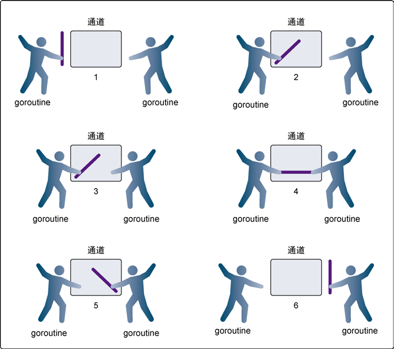

### 关于chaneel

以下描述了 select 语句的语法：

+ 每个case都必须是一个通信
+ 所有channel表达式都会被求值
+ 所有被发送的表达式都会被求值
+ 如果任意某个通信可以进行，它就执行；其他被忽略。
+ 如果有多个case都可以运行，Select会随机公平地选出一个执行。其他不会执行。 否则：
+ 如果有default子句，则执行该语句。
+ 如果没有default字句，select将阻塞，直到某个通信可以运行；Go不会重新对channel或值进行求值。

### 双引号和单引号
结论写在最前：在Go语言中不倾向于使用单引号来表示字符串，请根据需要使用双引号或反引号。

一个Go语言字符串是一个任意字节的常量序列。Go语言的字符串类型在本质上就与其他语言的字符串类型不同。Java的String、C++的std::string以及Python3的str类型都只是定宽字符序列，而Go语言的字符串是一个用UTF-8编码的变宽字符序列，它的每一个字符都用一个或多个字节表示。

Go语言中的字符串字面量使用 双引号 或 反引号 来创建：

双引号用来创建可解析的字符串字面量(支持转义，但不能用来引用多行)； 
反引号用来创建原生的字符串字面量，这些字符串可能由多行组成(不支持任何转义序列)，原生的字符串字面量多用于书写多行消息、HTML以及正则表达式。 

### defer

关于defer比较熟悉的是，先进先出之类的栈运行方法，这里有一个特别的。

    func calc(index string, a, b int) int {
        ret := a + b
        fmt.Println(index, a, b, ret)
        return ret
    }

    func main() {
        a := 1
        b := 2
        defer calc("1", a, calc("10", a, b))
        a = 0
        defer calc("2", a, calc("20", a, b))
        b = 1
    }
这里的输出结果：

    10 1 2 3
    20 0 2 2
    2 0 2 2
    1 1 3 4

表示虽然主要的语句 defer calc(“1” defer了，但是里面的一个函数没有defer，如果吧这个函数放到里面，会报错。。but! We can find out that the defer sysntax is not defer the whole line, it just defer a integrate command. 

### 关于watigroup

done表示结束一个goroutine；wait表示等待所有goroutine结束；add表示添加，这里有一个[链接](https://stackoverflow.com/questions/19208725/example-for-sync-waitgroup-correct)更好的理解，出个题目吧：

    type UserAges struct {
        ages map[string]int
        sync.Mutex
    }

    func (ua *UserAges) Add(name string, age int) {
        ua.Lock()
        defer ua.Unlock()
        ua.ages[name] = age
    }

    func (ua *UserAges) Get(name string) int {
        if age, ok := ua.ages[name]; ok {
            return age
        }
        return -1
    }
这里有什么问题

+ 首先是map，没有initialize这个歌map，在Add函数中，需要

    if ua.ages == nil {
		ua.ages = make(map[string]int)
	}

+ 还有最好defer一个 wg.Done() 再main函数中需要go 

### 通道

原子函数和互斥锁都能工作，但是依靠它们都不会让编写并发程序变得更简单，更不容易出错，或者更有趣。在 Go 语言里，不仅可以使用原子函数和互斥锁来保证对共享资源的安全访 问以及消除竞争状态，还可以使用通道，通过发送和接收需要共享的资源，在 goroutine 之间做同步。

当一个资源需要在 goroutine 之间共享时，通道在 goroutine 之间架起了一个管道，并提供了 确保同步交换数据的机制。声明通道时，需要指定将要被共享的数据的类型。可以通过通道共享内置类型、命名类型、结构类型和引用类型的值或者指针。

通道是否带有缓冲，其行为会有一些不同。理解这个差异对决定到底应该使用还是不使用缓冲很有帮助。

#### 无缓冲的通道
无缓冲的通道(unbuffered channel)是指在接收前没有能力保存任何值的通道。这种类型的通 道要求发送 goroutine 和接收 goroutine 同时准备好，才能完成发送和接收操作。如果两个 goroutine 没有同时准备好，通道会导致先执行发送或接收操作的 goroutine 阻塞等待。这种对通道进行发送 和接收的交互行为本身就是同步的。其中任意一个操作都无法离开另一个操作单独存在。

下面这个图片讲述了使用无缓冲的通道在 goroutine 之间同步

而如果要表示缓冲的话，就是在中间的通道中缓存一些指令